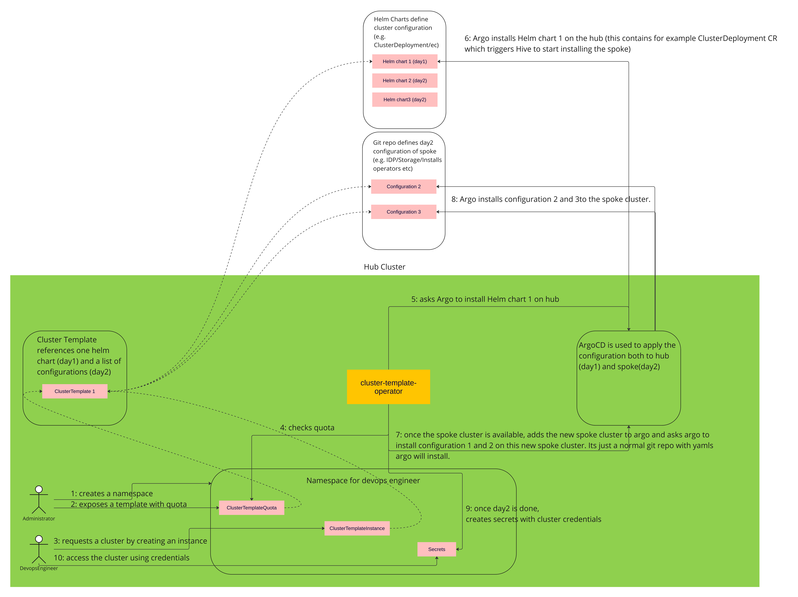

# Cluster as a service operator (CaaS)

**Self-service clusters with guardrails.**  CaaS operator provides an easy way to define clusters as templates and allows non-privileged developers or DevOps engineers to create instances of those templates.

## Features
 - **Deploys fully provisioned clusters:** Gives your users a cluster they can immediately start being productive with, rather than an empty cluster
 - **Gitops driven:** All configurations are applied using ArgoCD
 - **Integrated with ACM:** If the CaaS is on an ACM hub cluster, all the ACM management features will work seamlessly with the cluster installed using CaaS.
 - **Adds additional guardrails:** On top of classic k8s quotas, CaaS adds additional cost and count-based quotas, as well as the lifetime of your clusters
 - **Parameterizable:** You can decide to let some of the aspects of the template be parameterizable.
 - **Requires minimal permissions:** No oc get pods nor oc get secrets. Just one namespace, oc create ClusterTemplateInstance, oc get ClusterTemplate, oc get ClusterTemplateQuota, and oc get secret – all in one namespace. Nothing else.

## How it works


# How to install
## Prerequisites
 - Kubernetes cluster to run against.
 - Hypershift or Hive operator for cluster installation.

The easiest option is to use an OCP cluster with Multicluster Engine (MCE) installed on it. This way you will get all the dependencies already prepared and configured.

## Installation
**If you have an OCP cluster**, install the Cluster as a service operator from the OperatorHub (OCP console -> Operators -> OperatorHub -> search for “Cluster as a service operator -> install). This will install and configure the operator for your cluster so that it is immediately ready to use.
**If you don't have an OCP cluster**, follow the instructions from the OperatorHub page (https://operatorhub.io/operator/cluster-aas-operator).

The easiest option is to use an OCP cluster with Multicluster Engine (MCE) installed on it. This way you will get all the dependencies already prepared and configured.

# How to use
Cluster as a service operator comes with a few ready-to-be-used templates.
## Hypershift cluster without workers (not for production)

This template is not meant to be used in production. You can not run any workload on it nor can you ever scale it up. This template is only to be used to play with the CaaS and to understand its concepts.

### Prerequisites
Hypershift enabled and configured on your cluster:
 - If you have OCP + Multicluster Engine (MCE) installed on your cluster, follow [these steps](https://access.redhat.com/documentation/en-us/red_hat_advanced_cluster_management_for_kubernetes/2.7/html-single/clusters/index#hosted-enable-feature-aws)
 - If you don't use OCP + Multicluster Engine (MCE), follow [these steps](https://hypershift-docs.netlify.app/getting-started/)

### Steps
 1. Create a namespace “clusters” to store your clusters in
```
kind: Namespace
apiVersion: v1
metadata:
  name: clusters
  labels:
    argocd.argoproj.io/managed-by: argocd
```

 2. Create 2 secrets - one which contains the pull-secret and another one for the ssh public key
```
kind: Secret
apiVersion: v1
metadata:
  name: pullsecret-cluster
  namespace: clusters
stringData:
  .dockerconfigjson: '<your_pull_secret>'
type: kubernetes.io/dockerconfigjson
---
apiVersion: v1
kind: Secret
metadata:
  name: sshkey-cluster
  namespace: clusters
stringData:
  id_rsa.pub: <your_public_ssh_key>

```

 3. Allow to create the template in this namespace
```
apiVersion: clustertemplate.openshift.io/v1alpha1
kind: ClusterTemplateQuota
metadata:
  name: quota
  namespace: clusters
spec:
  allowedTemplates:
    - name: hypershift-cluster
```


 4. Create an instance of the hypershift template by creating the following yaml
```
apiVersion: clustertemplate.openshift.io/v1alpha1
kind: ClusterTemplateInstance
metadata:
  name: hsclsempty
  namespace: clusters
spec:
  clusterTemplateRef: hypershift-cluster
```

### Check the cluster
Wait for the cluster to be ready.
 - `kubectl get ClusterTemplateInstance hsclsempty`
 - When the “status.phase” is “Ready”, you can log into the cluster
 - The credentials are exposed as secrets and referenced from the status (**kubeconfig**, **adminPassword**, **apiServerURL**)

## Hypershift cluster with [kubevirt](https://kubevirt.io/) virtual machine workers
This will deploy an entirely self-contained cluster, meaning that both the control plane and workers will be running on the hub cluster. The control plane will be using hypershift and the workers will be running as virtual machines using kubevirt.

### Prerequisites
Hypershift enabled and configured on your cluster:
 - If you have OCP + Multicluster Engine (MCE) installed on your cluster, follow [these steps](https://access.redhat.com/documentation/en-us/red_hat_advanced_cluster_management_for_kubernetes/2.7/html-single/clusters/index#hosted-enable-feature-aws)
 - If you don't use OCP + Multicluster Engine (MCE), follow [these steps](https://hypershift-docs.netlify.app/getting-started/)

Kubevirt enabled and configured on your cluster:
 - If you have OCP installed on your cluster, install OpenShift Virtualization from OperatorHub in your cluster
 - If you don't use OCP, follow the instructions in “install” part of [operatorhub.io](https://operatorhub.io/operator/community-kubevirt-hyperconverged)

### Steps
 1. Create a namespace “clusters” to store your clusters in
```
kind: Namespace
apiVersion: v1
metadata:
  name: clusters
  labels:
    argocd.argoproj.io/managed-by: argocd
```

 2. Create 2 secrets - one which contains the pull-secret and another one for the ssh public key
```
kind: Secret
apiVersion: v1
metadata:
  name: pullsecret-cluster
  namespace: clusters
stringData:
  .dockerconfigjson: '<your_pull_secret>'
type: kubernetes.io/dockerconfigjson
---
apiVersion: v1
kind: Secret
metadata:
  name: sshkey-cluster
  namespace: clusters
stringData:
  id_rsa.pub: <your_public_ssh_key>

```

 3. Allow to create the template in this namespace
```
apiVersion: clustertemplate.openshift.io/v1alpha1
kind: ClusterTemplateQuota
metadata:
  name: quota
  namespace: clusters
spec:
  allowedTemplates:
    - name: hypershift-kubevirt-cluster
```

 4. Create an instance of the hypershift template by creating the following yaml
```
apiVersion: clustertemplate.openshift.io/v1alpha1
kind: ClusterTemplateInstance
metadata:
  name: hsclskubevirt
  namespace: clusters
spec:
  clusterTemplateRef: hypershift-kubevirt-cluster
```
### Check the cluster
Wait for the cluster to be ready.
 - `kubectl get ClusterTemplateInstance hsclskubevirt`
 - When the “status.phase” is “Ready”, you can log into the cluster
 - The credentials are exposed as secrets and referenced from the status (**kubeconfig**, **adminPassword**, **apiServerURL**)

# Documentation
## Learn about CRDs
 - [ClusterTemplate](./docs/cluster-template.md)
 - [ClusterTemplateInstance](./docs/cluster-template-instance.md)
 - [QuotaTemplateQuota](./docs/cluster-template-quota.md)
 - [API reference](./docs/api-reference.md)
## Permissions and env setup
 - [Custom configuration](./docs/custom-config.md)
 - [Permissions & env setup](./docs/permissions-and-env.md)
 - [Developer guide](./docs/dev-guide.md)

# License

Copyright 2022.

Licensed under the Apache License, Version 2.0 (the "License");
you may not use this file except in compliance with the License.
You may obtain a copy of the License at

    http://www.apache.org/licenses/LICENSE-2.0

Unless required by applicable law or agreed to in writing, software
distributed under the License is distributed on an "AS IS" BASIS,
WITHOUT WARRANTIES OR CONDITIONS OF ANY KIND, either express or implied.
See the License for the specific language governing permissions and
limitations under the License.
